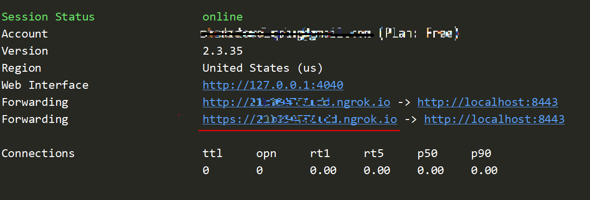

# Weather Telegram Bot

 The bot helps to find out the current weather in the specified city.
 It can also send a daily weather report for the whole day
 at a time specified by user. 
 There is a possibility to receive notifications of upcoming events 
 user chose.
 For instance, notification about an impending hurricane
 on the next day.

# Deploying on Heroku
From your dashboard on Heroku create a new app, once you create
 an app it will direct you to the deploy page.
 
Take example values from `.example.env` (modify if needed) 
and set them in your dashboard

Needed modifications:
- `DEBUG = false`
- Open the settings tab in new window and copy the domain of the app which will be 
 something like `https://appname.herokuapp.com/` and paste it in 
 the `HEROKU_DEPLOY_DOMAIN` environment variable
 
Now go back to the deploy tab and proceed with the steps:
* login to heroku: `heroku login` . Note that sometimes this method get stuck in waiting for login,
 if this is the case with you, you can login using: `heroku login -i`

#### (lines: 39-60) todo: remake description according to [this comment](https://github.com/shadeshade/weather_bot/issues/41#issuecomment-706539150)

Here we clone our repository and open 
in development environment:
```
git clone "https://github.com/shadeshade/weather_bot.git"
cd weather_bot
```
Create an empty app on Heroku:
```
heroku create
git remote -v
```

Now we can use git to push our code to the Heroku remote:
```
git push heroku master
heroku open
```

At this point you will see the building progress in your terminal, 
if everything went okay you will see something like this
```
remote: -----> Launching...
remote:        Released v6
remote:        https://project-name.herokuapp.com/ deployed to Heroku
remote:
remote: Verifying deploy... done.
```
Now go to the app page (the link of the domain you copied before) and add 
to the end of the link /setwebhook so that the address will be something 
like https://appname.herokuapp.com/setwebhook, if you see webhook setup 
ok then you are ready to go!

# Deploying on Local Host (Ngrok)
 
Download Ngrok from the link `https://ngrok.com/download`.
Carry out the following steps:

1. Clone the repository to your development environment
```
git clone "https://github.com/shadeshade/weather_bot.git"
cd weather_bot
```

2. Install requirements: `pip install requirements.txt`

3. `ngrok http 8443` . You will get something like this:


4. Setup environment variables in `.env` file basing on `.exampe.env` file.

    Needed modifications:
    - `DEBUG = true`
    - Set the variable `NGROK_DEPLOY_DOMAIN` to a value you 
    got on a previous step

5. Now you can start your bot: `python run.py` 
